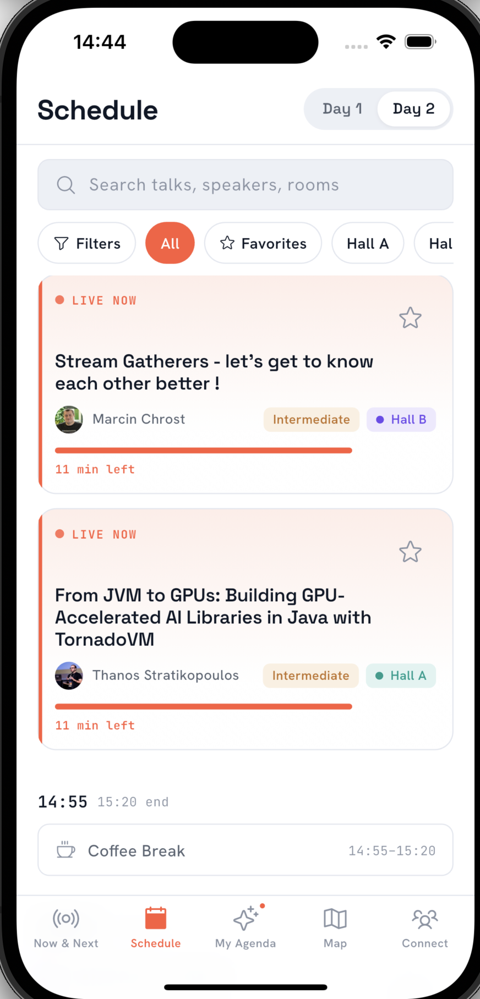

# jPrime Conference Companion App

A Flutter mobile app for the [jPrime](https://jprime.io) conference — real-time schedule, interactive venue map, attendee networking via QR codes, live Q&A, push notifications, and more.

<p align="center">
  
  
  
  
</p>

## Quick Start

> **Only prerequisite:** [Flutter SDK](https://docs.flutter.dev/get-started/install) `>=3.11.3`
>
> Firebase, API keys, and all config files are **already included** — no extra setup needed.

```bash
git clone https://github.com/Zenlingo/jprime_hackathon.git
cd jprime_hackathon/mobile_app
flutter pub get
flutter run
```

That's it — the app should be running on your connected device or emulator.

## Platform-Specific Notes

### Android

```bash
# List available devices and emulators
flutter devices

# Launch an Android emulator (if not already running)
flutter emulators --launch <emulator_name>

# Run the app
flutter run
```

Requires: Android Studio, SDK API 34+, JDK 17.

> **Tip:** Open Android Studio → Device Manager → Create/Start a virtual device if you don't have one.

### iOS (macOS only)

```bash
# Install iOS dependencies (first time only)
cd ios && pod install && cd ..

# Launch iOS Simulator
open -a Simulator

# Run the app
flutter run
```

Requires: Xcode 15+, CocoaPods.

> **Tip:** You can also pick a specific simulator: `flutter run -d "iPhone 16"`

### Windows / macOS (desktop)

```bash
flutter run -d windows
flutter run -d macos
```

## Building Release Versions

```bash
# Android APK
flutter build apk --release

# Android App Bundle (Play Store)
flutter build appbundle --release

# iOS (requires Apple Developer account)
flutter build ipa --release
```

## Troubleshooting

| Problem | Fix |
|---------|-----|
| `flutter doctor` shows issues | Follow the suggested fixes for your platform |
| iOS pod errors | `cd ios && pod install --repo-update && cd ..` |
| Android build fails | Ensure `JAVA_HOME` points to JDK 17 and Android SDK is up to date |
| Firebase errors | Config files are included in the repo — verify they haven't been accidentally deleted |
| Camera/location not working | Check device permissions; the app requests them at runtime |
| Notifications not appearing | Android 13+ needs POST_NOTIFICATIONS permission; iOS — allow when prompted |

---

For architecture, tech stack, and project structure see [TECH_STACK.md](TECH_STACK.md).
