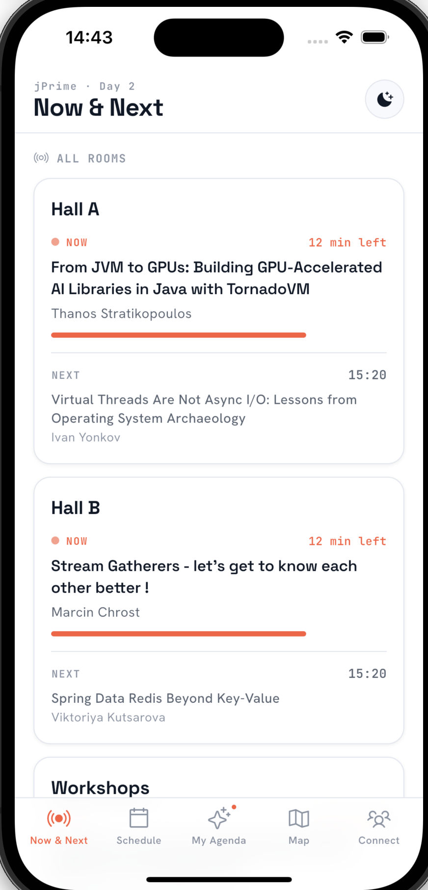
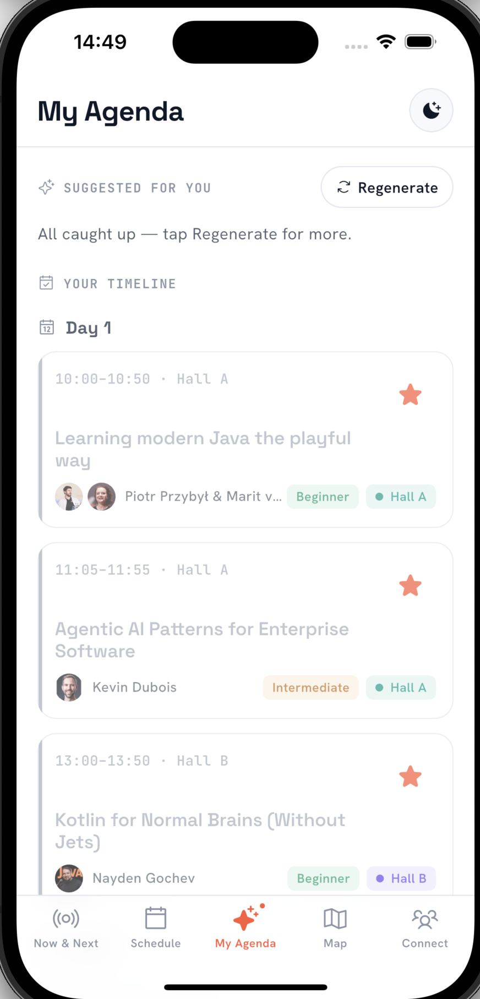
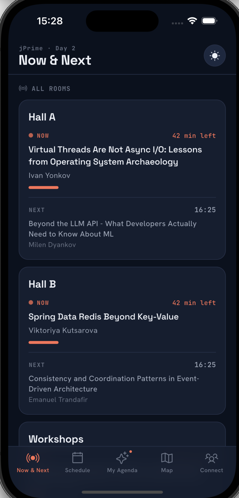

# jPrime Conference Companion App

A Flutter mobile app for the [jPrime](https://jprime.io) conference — real-time schedule, interactive venue map, attendee networking via QR codes, live Q&A, push notifications, and more.

<p align="center">
  
  
  
  
</p>

## Prerequisites

- **Flutter SDK** `>=3.11.3` — [Install Flutter](https://docs.flutter.dev/get-started/install)
- **Firebase project** configured (`google-services.json` / `GoogleService-Info.plist` already included)

### Android / Windows

| Tool | Version |
|------|---------|
| Android Studio | Latest stable |
| Android SDK | API 34+ |
| Java JDK | 17 |

### macOS / iOS

| Tool | Version |
|------|---------|
| Xcode | 15+ |
| CocoaPods | Latest (`sudo gem install cocoapods`) |
| iOS deployment target | 16.0 |

## Getting Started

```bash
# 1. Clone the repo
git clone https://github.com/Zenlingo/jprime_hackathon.git
cd jprime_hackathon/mobile_app

# 2. Install dependencies
flutter pub get

# 3. Verify your environment
flutter doctor
```

## Running the App

### Android

```bash
flutter devices        # List available devices/emulators
flutter run            # Run on connected device or emulator
```

Or open the project in **Android Studio**, select a device, and press **Run**.

### iOS (macOS only)

```bash
cd ios && pod install && cd ..
flutter run
```

Or open `ios/Runner.xcworkspace` in **Xcode**, select a simulator/device, and press **Run**.

### Windows / macOS

```bash
flutter run -d windows
flutter run -d macos
```

## Building Release Versions

### Android APK

```bash
flutter build apk --release
# Output: build/app/outputs/flutter-apk/app-release.apk
```

### Android App Bundle (Play Store)

```bash
flutter build appbundle --release
# Output: build/app/outputs/bundle/release/app-release.aab
```

### iOS (requires Apple Developer account)

```bash
flutter build ipa --release
# Output: build/ios/ipa/*.ipa
```

## Troubleshooting

- **`flutter doctor` shows issues** — follow the suggested fixes for your platform.
- **iOS pod errors** — run `cd ios && pod install --repo-update && cd ..`
- **Android build fails** — ensure `JAVA_HOME` points to JDK 17 and Android SDK is up to date.
- **Firebase errors** — verify `android/app/google-services.json` and `ios/Runner/GoogleService-Info.plist` exist.
- **Camera/location not working** — check device permissions; the app requests them at runtime via `permission_handler`.
- **Notifications not appearing** — on Android 13+ the app needs POST_NOTIFICATIONS permission; on iOS allow notifications when prompted.

---

For technical details see [TECH_STACK.md](TECH_STACK.md).
