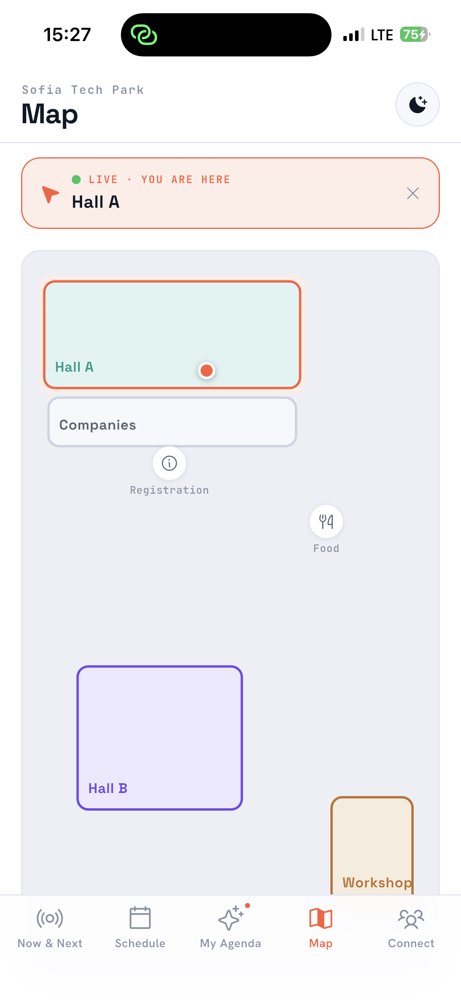
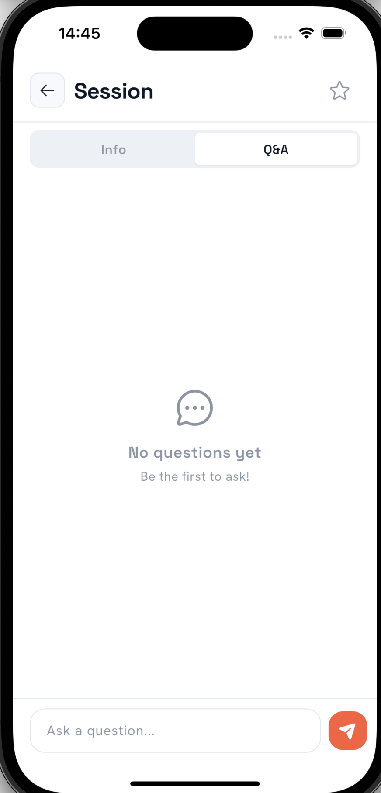
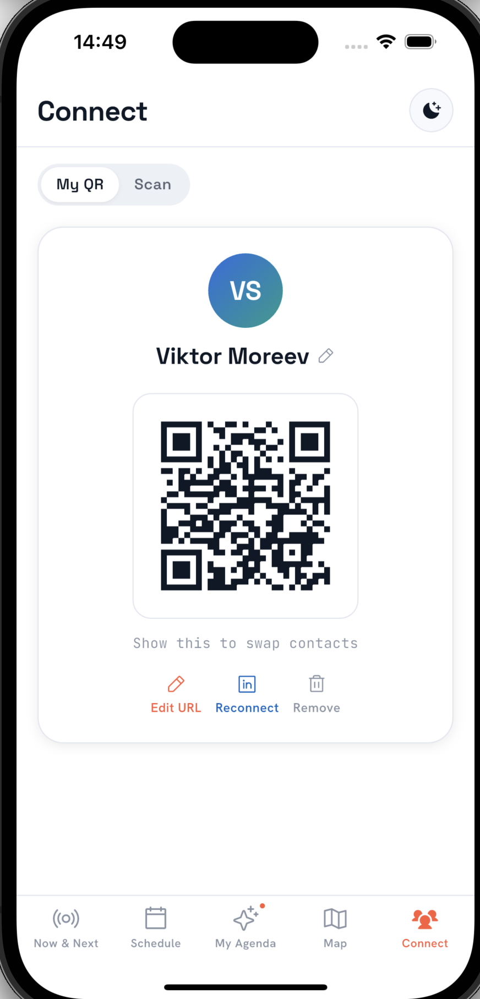
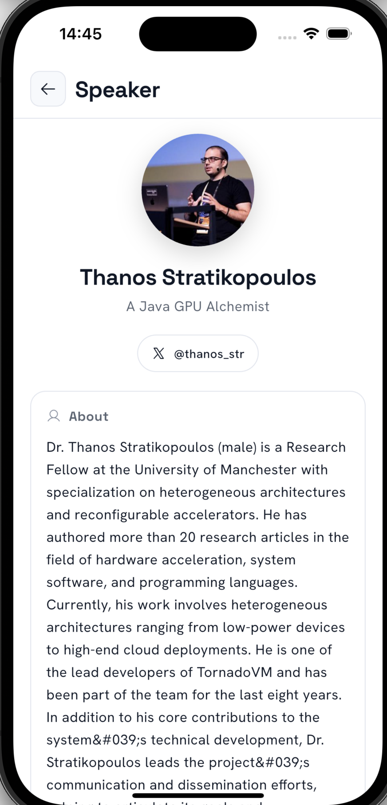
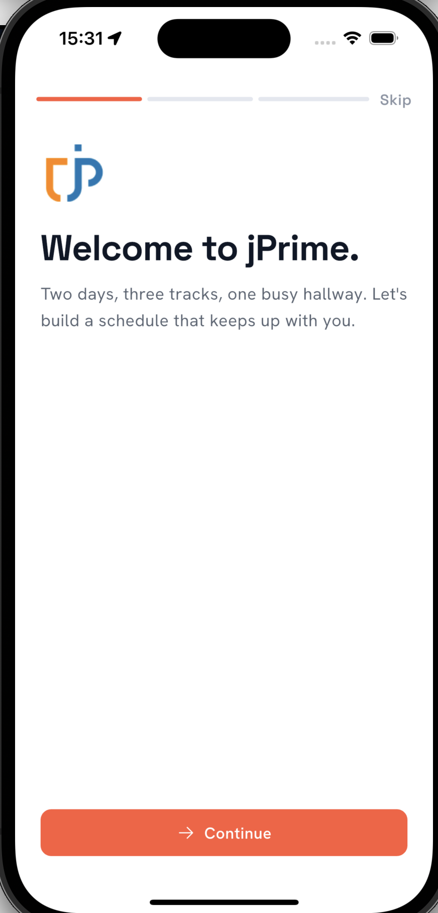
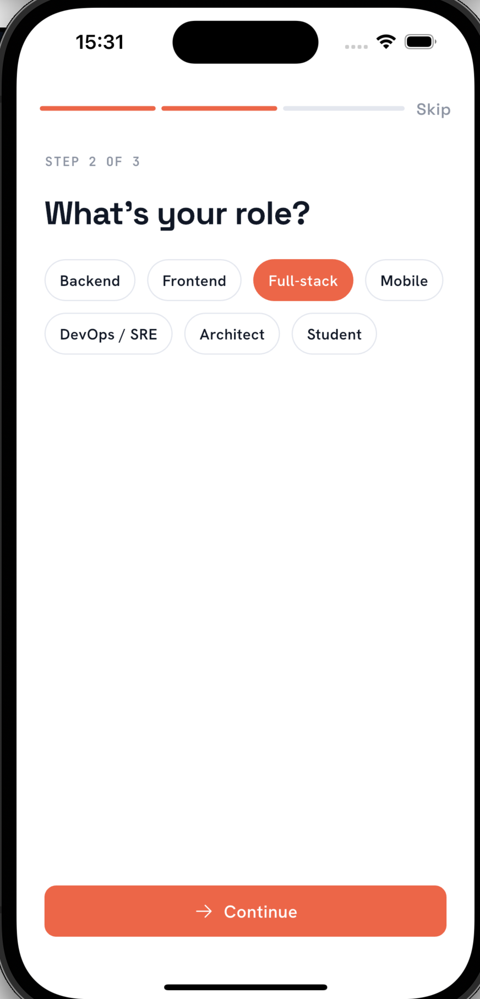
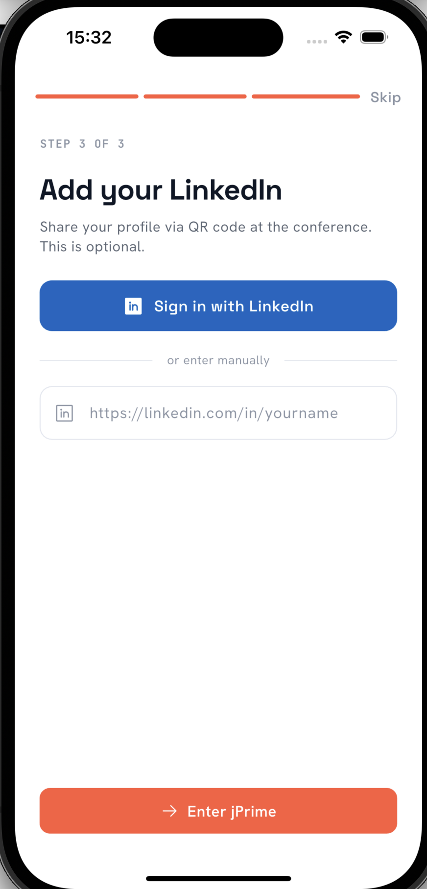

# Technical Overview

## Features

| Feature | Description |
|---------|-------------|
| **Now & Next** | Real-time view of currently running and upcoming sessions with live progress indicators |
| **Schedule** | Full multi-day conference schedule across 3 halls (Hall A, Hall B, Workshops) |
| **My Agenda** | Personal schedule built from favorited sessions, persisted locally |
| **Interactive Map** | Venue map with GPS-based "You are here" detection and room highlighting |
| **Connect** | Generate a QR code from your LinkedIn profile; scan other attendees' codes to network |
| **Session Q&A** | Live Q&A powered by Firebase Firestore — ask questions, upvote others' questions in real time |
| **Reminders** | Push notifications 10 minutes before favorited sessions |
| **Dark Mode** | Full light and dark theme support |
| **Onboarding** | Guided first-time user experience |

<p align="center">
  
  
  
  
</p>

## Tech Stack

| Layer | Technology |
|-------|-----------|
| Framework | Flutter 3.11.3+ / Dart 3.11.3+ |
| Backend | Firebase (Firestore for real-time Q&A) |
| Data source | jprime.io website scraping + JSON caching |
| Local storage | SharedPreferences |
| Notifications | flutter_local_notifications + timezone |
| Location | geolocator + point-in-polygon venue detection |
| QR | qr_flutter (generation) + mobile_scanner (scanning) |
| Typography | Google Fonts (Space Grotesk, Hanken Grotesk, JetBrains Mono) |
| Icons | Phosphor Icons |

## Architecture

```
┌─────────────────────────────────────────────────┐
│                    AppShell                      │
│           (IndexedStack + BottomNav)             │
├──────┬──────┬──────┬──────┬─────────────────────┤
│Now & │Sched-│  My  │ Map  │      Connect        │
│ Next │ ule  │Agenda│      │                     │
├──────┴──────┴──────┴──────┴─────────────────────┤
│                  Widgets Layer                   │
│  SessionCard, Avatar, TrackTag, LevelBadge ...  │
├─────────────────────────────────────────────────┤
│                 Data / Services                  │
│  ApiService │ QAService │ NotificationService   │
│  SampleData │ VenueZones                        │
├─────────────────────────────────────────────────┤
│         SharedPreferences  │  Firestore          │
└─────────────────────────────────────────────────┘
```

**Key patterns:**
- **StatefulWidget** state management with state lifted to `AppShell`
- **Offline-first** — schedule and speaker data cached in SharedPreferences
- **Real-time streams** — Firestore snapshots for live Q&A
- **Overlay navigation** — session/speaker details rendered as full-screen overlays
- **ThemeExtension** — custom `JPThemeColors` design tokens for consistent theming

## Project Structure

```
lib/
├── main.dart                      # Entry point, Firebase init
├── app_shell.dart                 # Root navigation (5-tab IndexedStack)
├── firebase_options.dart          # Firebase config (auto-generated)
│
├── theme/
│   └── app_theme.dart             # Design tokens, light/dark ThemeData
│
├── screens/
│   ├── now_next_screen.dart       # Current + upcoming sessions
│   ├── schedule_screen.dart       # Full multi-day schedule
│   ├── my_agenda_screen.dart      # Favorited sessions
│   ├── map_screen.dart            # Interactive venue map + GPS
│   ├── connect_screen.dart        # QR generation & scanning
│   ├── session_detail_screen.dart # Session info + Q&A tab
│   ├── session_qa_section.dart    # Firestore-powered Q&A
│   ├── speaker_detail_screen.dart # Speaker profile overlay
│   ├── onboarding_screen.dart     # First-run experience
│   └── linkedin_webview_screen.dart # LinkedIn auth WebView
│
├── widgets/                       # 16 reusable UI components
│   ├── session_card.dart          # Main schedule card
│   ├── app_header.dart            # Screen header
│   ├── avatar.dart                # Speaker avatar
│   ├── track_tag.dart             # Hall/track indicator
│   ├── level_badge.dart           # Difficulty level
│   ├── live_dot.dart              # Live session pulse
│   ├── fav_star.dart              # Favorite toggle
│   ├── progress_bar.dart          # Session progress
│   ├── empty_state.dart           # Empty list placeholder
│   ├── segmented_control.dart     # Tab selector
│   ├── jp_button.dart             # Custom button
│   ├── jp_chip.dart               # Chip component
│   ├── jp_switch.dart             # Custom switch
│   └── section_label.dart         # Section headers
│
└── data/
    ├── sample_data.dart           # Models: SessionData, SpeakerData, JPData
    ├── api_service.dart           # jprime.io scraper + cache layer
    ├── qa_service.dart            # Firestore Q&A CRUD
    ├── notification_service.dart  # Local push notification scheduling
    └── venue_zones.dart           # GPS polygon zones for venue rooms

test/                              # 10 test files
├── widget_test.dart               # Theme smoke test
├── data/
│   ├── sample_data_test.dart      # Data model unit tests
│   └── venue_zones_test.dart      # Point-in-polygon tests
└── widgets/
    ├── widget_test_helpers.dart    # Test utilities
    ├── empty_state_test.dart
    ├── fav_star_test.dart
    ├── level_badge_test.dart
    ├── live_dot_test.dart
    ├── progress_bar_test.dart
    └── track_tag_test.dart

assets/                            # Images and venue assets
tool/
└── check_zones.dart               # Venue zone validation utility
```

## Dependencies

### Production

| Package | Purpose |
|---------|---------|
| `google_fonts` | Space Grotesk, Hanken Grotesk, JetBrains Mono typography |
| `phosphor_flutter` | Icon set |
| `qr_flutter` | QR code generation for networking |
| `shared_preferences` | Local persistence (favorites, cache, user prefs) |
| `url_launcher` | Open external links |
| `webview_flutter` | LinkedIn authentication WebView |
| `mobile_scanner` | Camera-based QR code scanning |
| `permission_handler` | Camera and location permission management |
| `geolocator` | GPS location services for venue map |
| `firebase_core` | Firebase initialization |
| `cloud_firestore` | Real-time database for session Q&A |
| `uuid` | Unique identifiers for Q&A questions |
| `flutter_local_notifications` | Push notification scheduling |
| `timezone` | Timezone-aware notification scheduling |

### Dev

| Package | Purpose |
|---------|---------|
| `flutter_test` | Widget and unit testing |
| `flutter_lints` | Dart lint rules |
| `flutter_launcher_icons` | App icon generation from `assets/jprime-icon-1024.png` |

## Testing

```bash
# Run all tests
flutter test

# Run a specific test file
flutter test test/data/sample_data_test.dart

# Run with coverage
flutter test --coverage
```

**Test coverage includes:**
- Data model unit tests (SessionData, SpeakerData, JPData parsing and logic)
- Venue zone point-in-polygon detection tests
- Widget tests for core UI components (TrackTag, LevelBadge, LiveDot, ProgressBar, FavStar, EmptyState)

## Firebase Setup

The app uses Firebase Firestore for the live Q&A feature. Configuration files are already included:

- **Android**: `android/app/google-services.json`
- **iOS**: `ios/Runner/GoogleService-Info.plist`
- **Dart config**: `lib/firebase_options.dart`

To use your own Firebase project, replace these files and update `firebase_options.dart` using [FlutterFire CLI](https://firebase.flutter.dev/docs/cli/).

### Firestore Data Model

```
questions (collection)
├── {questionId}
│   ├── sessionId: string
│   ├── text: string
│   ├── authorName: string
│   ├── authorId: string
│   ├── timestamp: Timestamp
│   ├── upvotes: number
│   └── upvotedBy: string[]
```

## Screenshots

| Now & Next | Schedule | My Agenda | Map |
|:---:|:---:|:---:|:---:|
|  |  |  |  |

| Session Detail | Speaker | Q&A | Connect |
|:---:|:---:|:---:|:---:|
|  |  |  |  |

| Onboarding 1 | Onboarding 2 | Onboarding 3 | Dark Mode |
|:---:|:---:|:---:|:---:|
|  |  |  |  |
